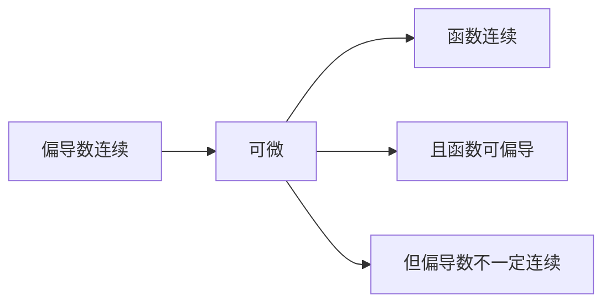

## 8-多元函数微分学-1
### n 维点集

邻域

$$U(P_0,\delta)=\{(x,y)|\sqrt{(x-x_0)^2+(y-y_0)^2}\}$$

去心邻域

$$\overset{\circ}{U}(P_0,\delta)=\{(x,y)|\sqrt{(x-x_0)^2+(y-y_0)^2}\}$$

内点、外点和边界点
- 若存在 $\delta$ ，使得 $U(P_0,\delta)\subset E$,则 $P_0$ 为 $E$ 的内点
- 若存在 $\delta$ ，使得 $U(P_0,\delta)\cap E=\emptyset$ ,则 $P_0$ 为 $E$ 的外点
- 若对于任意 $\delta$ ，都有 $U(P_0,\delta)$ 既有属于 $E$ 的点，又有不属于 $E$ 的点，则 $P_0$ 为 $E$ 的边界点

> 特殊情况的边界点
> 有理数集 $Q$ ，所有点均为边界，并且无理数点也是其边界

开集和闭集
若 $E$ 中每个点都是其内点，称 $E$ 为开集

区域
若 $E$ 中任意两点都能用内部的折线连接起来，则称 $E$ 为连通的
连通的开集称为开区域，简称区域
区域连同其边界称为闭区域

> $\{ (x,y)|xy > 0 \}$ 不是连通的
> $\{ (x,y)|xy\geq 0 \}$ 是连通的

### 多元函数的定义

比较简单，先不写了

### 多元函数的极限与连续性

任意 $\varepsilon>0$ ，存在 $\delta>0$ ，使得对于 $0<|x-x_0|<\delta$，都有 $|f(x)-A|<\varepsilon$ 

$$|f(P)-A|<\varepsilon$$

二重极限

$$\lim_{(x,y)\rightarrow(x_0,y_0)} f(x,y)=A$$

与一元函数不同的地方在于，极限的逼近过程可以选取不同的路径

> 例子
>
> $$\frac{xy}{x^2+y^2}$$
>
> 从 x 轴或者 y 轴趋近得到极限为 0，但是选取路径 y=x，得到极限为 1/2
> 令 y=kx，原式=$\frac{k}{1+k^2}$ ，会随着 k 变化
> 

$$\frac{xy^2}{x^2+y^4}$$

累次极限

$$\lim_{x\rightarrow 0} [\lim_{y\rightarrow 0}f(x,y)] \quad or \quad \lim_{y\rightarrow 0} [\lim_{x\rightarrow 0}f(x,y)]$$

定义在有界闭区域上的二元连续函数

有界性定理
最值定理
零点存在定理
介值定理

构造折线，降维，应用零点存在定理

## 8-多元函数微分学-2
### 偏导

偏导记号规范

$$ \frac{\partial f}{\partial x}=f_x $$

$$ \frac{\partial^2 f}{\partial x\partial y}=f_{xy} $$

### 全微分

$$\Delta f=A\Delta x+B\Delta y+o(\sqrt{(\Delta x)^2+(\Delta y)^2})$$

$$\frac{f(x,y)}{ \sqrt{x^2+y^{2}}}$$

### 可微与可偏导的关系

## 8-多元函数微分学-3

### 隐函数

双元/多元隐函数

$$F(x,y)=0$$

$$\frac{dy}{dx}=-\frac{F_x}{F_y}$$

隐函数组 u,v

$$
\begin{cases}
F(x,y,u(x,y),v(x,y)) = 0 \\ 
G(x,y,u(x,y),v(x,y)) = 0 \\
\end{cases}
$$

分别对 x(y) 偏导

$$
\begin{cases}
F_{x}+F_{u}u_{x}+F_{v}v_{x} = 0 \\ 
G_{x}+G_{u}u_{x}+G_{v}v_{x} = 0 \\
\end{cases}
$$

### 方向导数与梯度

$$\frac{\partial f}{\partial \vec{l}}=f_{x}\cos{\alpha}+f_{y}\sin{\alpha}$$

$$\frac{\partial f}{\partial \vec{l}}=\nabla u \cdot \vec{l^0}$$

### 多元微分学在几何学中的应用

#### 切线

曲线方程：

$$
\begin{cases}
F(x,y,z) = 0 \\ 
G(x,y,z) = 0 \\
\end{cases}
$$

$$
\begin{cases}
\vec{n_1}=(F_x,F_y,F_z) \\ 
\vec{n_2}=(G_x,G_y,G_z) \\
\end{cases}
$$

$$\vec{\tau}=\vec{n_{1}}\times \vec{n_2}$$

#### 法向量

$$\vec{n}=(F_x,F_y,F_z)$$

### Taylor 公式与极值

$$F(t)=f(x_{0}+t\Delta x,y_{0}+t\Delta y)$$

$$(\Delta x\frac{\partial }{\partial x}+\Delta y\frac{\partial }{\partial y})f=\Delta x\frac{\partial f}{\partial x}+\Delta y\frac{\partial f}{\partial y}$$

#### 极值的判断

$$H=f_{xx}f_{yy}-f_{xy}^2$$

### 条件极值：拉格朗日乘数法

在约束条件 $\varphi(x,y,z)=0$ 下，求 $f(x,y,z)$ 的极值

$$L(x,y,z,\lambda)=f(x,y,z)+\lambda\varphi(x,y,z)$$

## 9-重积分
### 二维

#### 直角坐标

#### 极坐标

#### 坐标变换

$$J=\begin{bmatrix} u_x & u_y \\ v_x & v_y \end{bmatrix}$$

### 三维

#### 直角坐标/柱坐标/球坐标

#### 坐标变换

$$
J=
\begin{bmatrix}
x_u & x_v & x_w \\ 
y_u & y_v & y_w  \\ 
z_u & z_v & z_w
\end{bmatrix}
$$

## 9-重积分的应用
### 求解物理问题

todo: 两柱面相交

### 求曲面面积

曲面法向量：

$$\vec{n}=(z_x,z_y,-1)$$

将其投影到 xy 平面即可计算面积

$$dS=\sqrt{1+{z_x}^2+{z_y}^2}dxdy$$

todo：双元形式

$$
\begin{cases}
x=x(u,v) \\
y=y(u,v) \\ 
z=z(u,v) \\
\end{cases}
$$

两个切向量

$$
\begin{cases}
\vec{r_u}=(x_u,y_u,z_u) \\
\vec{r_v}=(x_v,y_v,z_v) \\ 
\end{cases}
$$

法向量

$$\vec{n}=\vec{r_u}\times \vec{r_v} $$

## 9.5-期中考试tips
### 极限

- 极坐标换元

### 偏导与微分

- 一阶偏导连续，则可微
- 偏导存在，不一定可微

### 微分的应用

- 方向导数：方向向量要化成单位向量

- 隐函数

- 求切向量/法向量
	- 两曲面的交线的切向量：曲面法向量叉乘

- 求极值
	- 不要忘记判断是否为极值 (H>0 才是极值，H=0 无法判断，但大概率遇不到)
	- 区域内部与区域外部分别求
	- 拉格朗日乘数法：不要算错
	- 如果觉得计算量大，可以尝试其他方法，如数形结合/三角换元/不等式

### 重积分

- 积分中值定理
- 坐标变换：不要漏乘雅可比行列式，也不要缺斤少两
- 对称性：区域和被积函数对称性较好的/题目所给积分较为复杂的，优先考虑对称性

### 重积分应用

- 求表面积：不要漏了侧面、底面
- 两柱面相交
	- 可以画两个四分之一圆周，然后图形就可以想得清楚一些
	- 反正理解不了，直接背吧（还要再看一下）

沟槽的最后期中考试只有 77 分

记录一下 details 和 spoiler 的用法

[details=" 总结 "]
此文本将被隐藏
[/details]

[spoiler] 此文本将被模糊处理 [/spoiler]

 
点击显示详细内容
 这是详细内容。 

## 10-曲线积分和曲面积分
### 第一类曲线积分

#### 概念

曲线积分

$$\int_C{f(x,y)ds}$$

环路积分

$$\oint_C{f(x,y)ds}$$

#### 计算

### 第一类曲面积分

#### 概念

$$\iint_{\Sigma}{f(x,y,z)dS}$$

#### 计算

$$
\begin{cases}
x=x(u,v) \\
y=y(u,v) \\ 
z=z(u,v) \\
\end{cases}
$$

$$\iint_{\Sigma}{f(x,y,z)dS}=\iint_{D_{uv}}{f(x(u,v),y(u,v),z(u,v))\sqrt{A^2+B^2+C^2}dudv}$$

其中

$$
A= \frac{\partial(y,z)}{\partial(u,v)} \quad
B=\frac{\partial(z,x)}{\partial(u,v)} \quad
C=\frac{\partial(x,y)}{\partial(u,v)}
$$

### 第二类曲线积分

#### 概念

$$\int_C{\mathbf{F}(x,y) \cdot d\mathbf{r}}$$

$$\int_C{P(x,y)dx+Q(x,y)dy}$$

#### 计算

### 第二类曲面积分

#### 概念

$$d\mathbf{S}=\mathbf{n}^0dS$$

$$\iint_{\Sigma^+}{\mathbf{F}(x,y,z) \cdot d\mathbf{S}}$$

$$\iint_{\Sigma^+}{Pdydz+Qdxdz+Rdxdy}$$

#### 计算

可以化为第一类曲面积分：

$$\iint_{\Sigma^+}{\mathbf{F}(x,y,z) \cdot d\mathbf{S}}=\iint_{\Sigma^+}{\mathbf{F} \cdot \mathbf{n}^0 dS}$$

由第一类曲面积分可得：

$$\iint_{\Sigma^+}{\mathbf{F}(x,y,z) \cdot d\mathbf{S}}=\iint_{\Sigma^+}{\frac{PA+QB+RC}{\sqrt{ A^2+B^2+C^2 }}dS}=\iint_{\Sigma^+}{(PA+QB+RC)dudv}$$

当曲面可以写成 $z(x,y)$ 的形式时，可视为特殊情况：

$$\iint_{\Sigma^+}{\mathbf{F}(x,y,z) \cdot d\mathbf{S}}=\iint_{\Sigma^+}{(Pz_{x}+Qz_{y}-R)dxdy}$$

### Green 公式及其应用

#### Green 公式

$$\oint_C{Pdx+Qdy}=\iint_{D}({\frac{\partial{Q}}{\partial{x}}-\frac{\partial{P}}{\partial{y}}})dxdy$$

$$\oint_C{Pdx}=-\iint_{D}{\frac{\partial{P}}{\partial{y}}}dxdy$$

$$\oint_C{Qdy}=\iint_{D}{\frac{\partial{Q}}{\partial{x}}}dxdy$$

#### 路径无关/解析函数

$$\oint_C{Pdx+Qdy}=0$$

#### 全微分求积与全微分方程
积分因子：

$$\frac{1}{x} \quad \frac{1}{y} \quad \frac{1}{xy} \quad \frac{1}{x^2+y^2} \quad \frac{1}{\sqrt{ x^2+y^2 }}$$

### Gauss 公式

$$\iint_{\Sigma^+}{\mathbf{F}(x,y,z) \cdot d\mathbf{S}}=\iiint_{\Omega}{\nabla \cdot \mathbf{F} dV}$$

### Stokes 公式

疑似不考

## 11-级数
### 数项级数的概念和基本性质

级数收敛的必要条件：若级数 $\sum_{n=1}^{\infty} a_{n}$ 收敛，则：

$$
\lim_{ n \to \infty }{a_{n}}=0 
$$

### 正项级数及其敛散性的判别法

#### 收敛原理

正项级数 $\sum_{n=1}^{\infty} a_{n}$ 收敛的充要条件是其部分和数列有上界。

#### p 级数

$$
\sum_{n=1}^{\infty} \frac{1}{n^p}=
\begin{cases}
\text{收敛} \quad p>1\\
\text{发散} \quad p \leq 1
\end{cases}
$$

$$
S_{n}=\sum_{k=1}^{n} \frac{1}{k^p}
$$

#### 比较判别法

本身比较简单。

极限形式：若 $\lim_{ n \to \infty }{\frac{a_{n}}{b_{n}}}=l$ ，则
* $0<l<+\infty$ 时，相同敛散性
* $l=0$ 时，$\sum_{n=1}^{\infty} b_{n}$ 收敛 ~ $\sum_{n=1}^{\infty} a_{n}$ 收敛
* $l=+\infty$ 时，$\sum_{n=1}^{\infty} b_{n}$ 发散 ~ $\sum_{n=1}^{\infty} a_{n}$ 发散

#### 比值判别法

$$
\lim_{ n \to \infty} \frac{a_{n}}{b_{n}}
$$

#### 积分判别法

若：
* 非负函数 $f(x)$ 在 $[1,+\infty]$ 单调递减
* $a_{n}=f(n)$
则正项级数 $\sum_{n=1}^{\infty} a_{n}$ 与反常积分 $\int_{1}^{\infty}f(x)dx$ 有相同的敛散性。

### 任意项级数及其敛散性的判别法

#### 交错级数敛散性的判别法

形如： $\sum_{n=0}^{\infty}(-1)^{n-1}a_{n} \quad (a_{n}>0)$ 的级数，称为交错级数。

##### Leibniz 判别法

 若交错级数 $\sum_{n=0}^{\infty}(-1)^{n-1}a_{n} \quad (a_{n}>0)$ 满足：
- $0<a_{n+1} \leq a_{n}$ 
- $\lim_{ n \to \infty }{a_{n}}=0$ 
则该级数收敛，且其余项级数满足 $| \sum_{k=n+1}^{\infty}(-1)^{k-1}a_{k} | \leq a_{n+1}$

#### Abel 判别法和 Dirichlet 判别法

讨论形如： $\sum_{n=0}^{\infty}(-1)^{n-1}a_{n}b_{n}$ 的级数的敛散性。

##### Abel 引理
设 $a_{n}$ 为单调数列，$B_k = \sum_{i=1}^{k} b_i$，且 $|B_k| \leq M (k = 1, 2, \cdots )$，则

$$
\left| \sum_{k=1}^{n} a_k b_k \right| \leq M (|a_1| + 2 |a_n|).
$$

##### Abel 判别法
数列 $a_{n}$ 单调且有界，级数 $\sum_{n=0}^{\infty}b_{n}$ 收敛

##### Dirichlet 判别法
数列 $a_{n}$ 单调且趋于 0，数列 $b_{n}$ 的部分和 $\sum_{k=1}^{\infty}b_{k}$ 有界

### 函数项级数及其敛散性
比较简单，主要是定义，先不写了。

### 幂级数

$$
\sum_{n=0}^{\infty}a_{n}x^{n} 
$$

#### Abel 定理

- 若幂级数于 $x_{0}$ 处收敛，则当 $|x|<|x_{0}|$ 时，  $\sum_{n=0}^{\infty}a_{n}x^{n}$ 绝对收敛
- 若幂级数于 $x_{0}$ 处发散，则当 $|x|>|x_{0}|$ 时，  $\sum_{n=0}^{\infty}a_{n}x^{n}$ 发散

证明：

$$
\begin{align}
\lim_{ n \to \infty }a_{n}x_{0}^{n}=0 \\
|a_{n}x_{0}^{n}| \leq M \\
|a_{n}x^{n}| < |a_{n}x_{0}^{n} \frac{x^n}{x_{0}^{n}}|  \\
\leq  M |\frac{x^n}{x_{0}^{n}}| \\
\end{align}
$$

$$
\lim_{ n \to \infty }a_{n}x_{0}^{n}=0 
$$

$$
|a_{n}x_{0}^{n}| \leq M 
$$

$$
|a_{n}x^{n}| < |a_{n}x_{0}^{n} \frac{x^n}{x_{0}^{n}}|
\leq  M |\frac{x^n}{x_{0}^{n}}|
$$

#### 收敛半径

#### 系数模比值法

对幂级数 $\sum_{n=1}^{\infty} a_{n}x^{n}$，若 $\lim_{ n \to \infty }{\frac{a_{n+1}}{a_{n}}}=\rho$ ，则

$$
R=
\begin{cases}
0 &\rho=+\infty\\
\frac{1}{\rho} &0<\rho<+\infty\\
+\infty &\rho=0\\
\end{cases}
$$

#### 系数根比值法
对幂级数 $\sum_{n=1}^{\infty} a_{n}x^{n}$，若 $\lim_{ n \to \infty }{\sqrt[n]{a_{n}}}=\rho$ ，则

$$
R=
\begin{cases}
0 &\rho=+\infty\\
\frac{1}{\rho} &0<\rho<+\infty\\
+\infty &\rho=0\\
\end{cases}
$$

## 11.5-附录与补充

### 一阶线性非齐次微分方程求解公式

$$
y'+P(x)y=Q(x)
$$

我们希望把左边凑成全微分

于是，可以两边同乘 $e^{\int{Pdx}}$

$$
Q(x)e^{\int{Pdx}}=y'e^{\int{Pdx}}+Pye^{\int{Pdx}}=(ye^{\int{Pdx}})'
$$

$$
ye^{\int{Pdx}}=\int{Q(x)e^{\int{Pdx}}}dx+C
$$

$$
y=e^{-\int{Pdx}}(\int{Q(x)e^{\int{Pdx}}}dx+C)
$$

### 常用泰勒展开公式

泰勒展开：

$$
P(x)=f(x_{0})+f^{(1)}(x_{0})(x-x_{0})+\frac{f^{(2)}(x_{0})(x-x_{0})^{2}}{2!}+...+\frac{f^{(n)}(x_{0})(x-x_{0})^{n}}{n!}+...
$$

麦克劳林展开：

$$
P(x)=f(0)+f^{(1)}(0)x+\frac{f^{(2)}(0)x^{2}}{2!}+...+\frac{f^{(n)}(0)x^{n}}{n!}+...
$$

常见函数的泰勒展开 (麦克劳林展开)：

#### 指数函数

$$
e^x=1+x+\frac{x^2}{2!}+...+\frac{x^n}{n!}+...
$$

$$
a^x=e^x\ln{a}=1+x\ln{a}+\frac{(x\ln{a})^2}{2!}+...+\frac{(x\ln{a})^n}{n!}+...
$$

#### 三角函数与反三角函数

$$
\sin(x)=x-\frac{1}{3!}x^3+\frac{1}{5!}x^5-...+\frac{(-1)^{n}}{(2n+1)!}x^{2n+1}+...
$$

$$
\cos(x)=1-\frac{1}{2!}x^2+\frac{1}{4!}x^4-...+\frac{(-1)^{n}}{2n!}x^{2n}+...
$$

$$
\tan(x)=x+\frac{x^3}{3}+\frac{2x^5}{15}+\frac{17x^7}{315}+...
$$

$$
\arcsin(x)=x+\frac{1}{2}\frac{x^3}{3}+\frac{1\times3}{2\times4}\frac{x^5}{5}+\frac{1\times3\times5}{2\times4\times6}\frac{x^7}{7}+...+\frac{(2n-1)!!}{(2n)!!}\frac{x^{2n+1}}{2n+1}+...
$$

$$
\arctan(x)=x-\frac{1}{3}x^3+\frac{1}{5}x^5-...+\frac{(-1)^n}{2n+1}x^{2n+1}+...
$$

#### 双曲三角

$$
\sinh(x)=x+\frac{1}{3!}x^3+\frac{1}{5!}x^5+...+\frac{1}{(2n+1)!}x^{2n+1}+...
$$

$$
\cosh(x)=1+\frac{1}{2!}x^2+\frac{1}{4!}x^4+...+\frac{1}{2n!}x^{2n}+...
$$

$$
\tanh(x)=x-\frac{x^3}{3}+\frac{2x^5}{15}-\frac{17x^7}{315}+...
$$

#### 有理函数/根式函数

其实就是等比数列求和：

$$
\frac{1}{1+x}=1-x+x^2-x^3+\dots+(-x)^n+\dots (-1<x<1)
$$

后面两个通项都不太好写：

$$
\sqrt{1+x}= 1 + \frac{1}{2}x - \frac{1}{8}x^2 + \frac{1}{16}x^3 - \frac{5}{128}x^4 + \cdots
$$

$$
\frac{1}{\sqrt{1+x}} = 1 - \frac{1}{2}x + \frac{3}{8} x^2 - \frac{5}{16} x^3 + \frac{35}{128} x^4 + \cdots
$$

#### 对数函数

$$
\ln(1+x)=x-\frac{1}{2}x^2+\frac{1}{3}x^3-...+\frac{(-1)^{n+1}}{n}x^n+...(-1<x\leq1)
$$

$$
\ln(x)=(x-1)-\frac{1}{2}(x-1)^2+\frac{1}{3}(x-1)^3-...+\frac{(-1)^{n+1}}{n}(x-1)^n+...(0<x\leq2)
$$

$$
\ln(\frac{1+x}{1-x})=2(x+\frac{x^3}{3}+\frac{x^5}{5}+...+\frac{x^n}{n}+...)(-1<x<1)
$$

### Wallis 公式与双阶乘相关公式

$$
I_{n}=\int_{0}^{\frac{\pi}{2}}{\sin^{n}x}dx=\int_{0}^{\frac{\pi}{2}}{\cos^{n}x}dx
$$

$$
I_{n}=
\begin{cases}
\frac{(n-1)!!}{n!!} \cdot \frac{\pi}{2} \quad &n=2k\\ 
\frac{(n-1)!!}{n!!} \quad &n=2k-1 \\

\end{cases}
$$

由单调性：

$$
I_{2k+1}<I_{2k}<I_{2k-1}
$$

可推出一些结论：

$$
\lim_{ k \to \infty } {\frac{1}{2k+1}\left[ \frac{(2k)!!}{(2k-1)!!} \right]^2=\frac{\pi}{2}}
$$

$$
\frac{2}{\pi} \cdot \frac{1}{2k+1} < \left[ \frac{(2n-1)!!}{(2n)!!} \right]^2 < \frac{2}{\pi} \cdot \frac{1}{2k}
$$

$$
\frac{1}{2\sqrt{n}} < \frac{(2n-1)!!}{(2n)!!} < \frac{1}{\sqrt{2n+1}}
$$

### Stirling 公式（斯特林公式）

$$
n! \approx \sqrt{2 \pi n} \left( \frac{n}{e} \right)^n
$$

## 12-期末考试tips
感觉期末整体比期中简单一点（希望明天能考好点吧）

### 微分

* 可微/可导等一系列关系
* 求切向量
* 求极值时，注意 $f_{xx}$ 与 0 的关系，最后标明是最小值 or 最大值

### 积分

* 重积分换元时，注意雅可比行列式是否要取倒数
* 充分利用对称性
* Gauss 公式注意补充曲面的方向
* 求极值时，注意 $f_{xx}$ 与 0 的关系最后标明是最小值 or 最大值
* 全微分求积，注意积分因子，也可以看情况选择凑微分

### 级数

* Abel/Dirichlet 定理有时会很好用
* 有必要记忆一些常用 Taylor 公式
* 常用反例：奇偶项分别定义的级数

6.11 考完更新：忘记复习 Green 公式的条件和应用了，一开始太急了直接开始算，忘记关注函数的奇点了；虽然后来改过来了，但是下面这个式子好像正负号错了：

$$\oint_C{Pdx+Qdy}=\iint_{D}({\frac{\partial{Q}}{\partial{x}}-\frac{\partial{P}}{\partial{y}}})dxdy$$

就这样吧，这篇笔记应该不会更新了。

