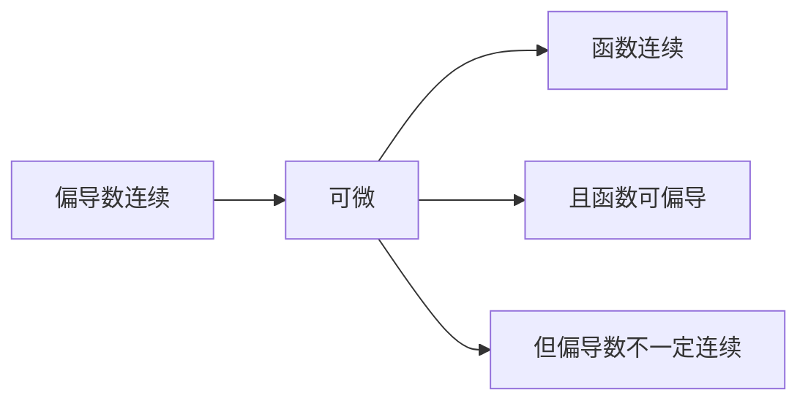

## 偏导

偏导记号规范

$$ \frac{\partial f}{\partial x}=f_x $$

$$ \frac{\partial^2 f}{\partial x\partial y}=f_{xy} $$

## 全微分

$$\Delta f=A\Delta x+B\Delta y+o(\sqrt{(\Delta x)^2+(\Delta y)^2})$$

$$\frac{f(x,y)}{ \sqrt{x^2+y^{2}}}$$

## 可微与可偏导的关系

